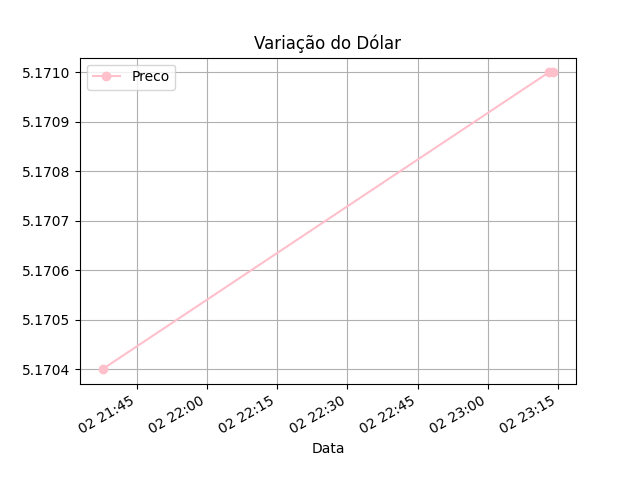

# 🕵️ Detetive de Preços Python

Projeto desenvolvido no **Ubuntu** para monitoramento e análise da variação do dólar em tempo real.

## 🚀 Funcionalidades
* **Extração:** Coleta cotações atuais via API.
* **Histórico:** Salva os dados automaticamente em um arquivo CSV.
* **Inteligência:** Analisa médias e variações usando a biblioteca **Pandas**.
* **Visualização:** Gera gráficos de tendência com **Matplotlib**.

## 🛠️ Tecnologias
* Python 3
* Pandas & Matplotlib
* Git & GitHub
* Linux Terminal

## 📊 Visualização do Projeto
Abaixo, um exemplo da análise gerada pelo sistema:

---
*Desenvolvido por Rafael Brancalhão durante a jornada de aprendizado em Python.*